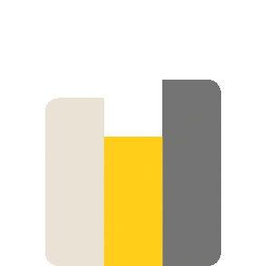

  <h1>Welcome to my profile </h1>
  <h1>About Me </h1>
   
Hi, I’m 15 years old student software and graphics designer in Turkey.

  <h1>Technologies I Use </h1>
    
  

  <h1>Github Stats </h1>
   
  
   
  
    
   

    <h1>Reach Me <h1>
  

